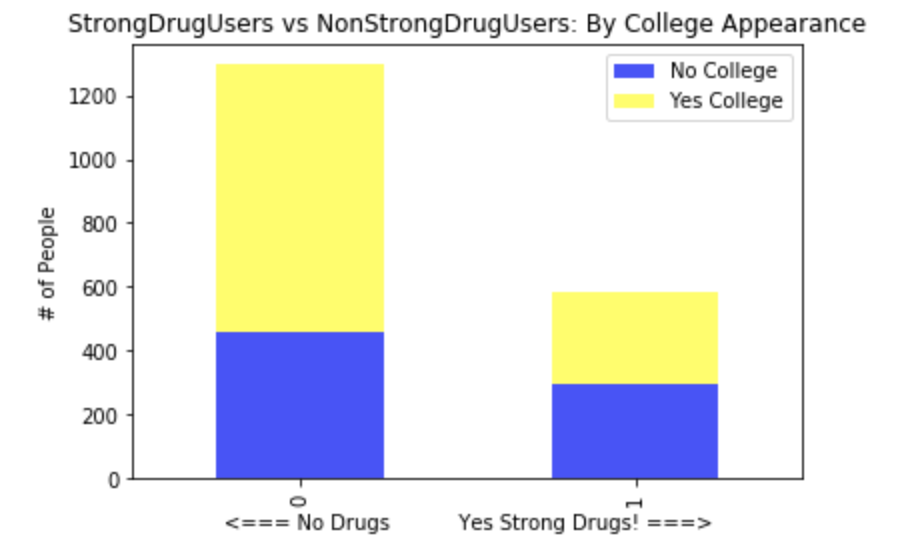

# Classification-of-Hard-Drug-Users

## Drugs Consumption Data Set:
* 1,885 records
* 12 Personal Measurement attributes (examples; scores on extraversion, impulsiveness, ...)
* Drug Usage activity of 18 different Legal and Illegal Drugs (examples: chocolate, alcohol, weed, heroin) based on 7 classes of Never Used, Used in the Last Decade, Year, Month, Week, or Day.

## Exploratory Data Analysis
* Assigned ‘Labels’, turning values numeric, had no Missing values
* Removing Bias from liars in the ‘Semer’ column (A Fake Drug used in the study to catch liars)
* Cleaned and created dummy variables for Gender and Lived in the U.K. since 55% of the dataset are from the United Kingdom.

## Feature Engineering
### Indicator / Interaction features
1. Created a Hard Drug binary column of whether you have ever done Crack, Heroin, or Ketamine.
2. Age: Classified into three categories of Young, Middle-Aged, Old
3. Education: had multiple selections for years attained, chose baseline column for whether they made it to College, indicator variable
4. Nicotine: indicator whether person smoked in past year
5. WeakDrugUse: Interaction feature summing use for legal ‘weaker’ drugs

## Feature Selection
* Used sklearn extra trees classifier for feature importance to indicate the top 10 performers in my interaction features
* insert image of results

## Visualizing for better understanding
* Insert Image of People who have or not

* explain

* explain

## Numerous Models for best F1
* Insert image of all Results
* explain which is best and why
* insert image of confusion matrix
* explain

## HyperParameter Tuning
* Used a randomized Gridsearch for classifier parameters, which seemed to not improve original top score.
* XGBoost for Randomforest which managed to bring original RMSE of __0.406__, down to __0.334__ for our testing set.

## Take aways
